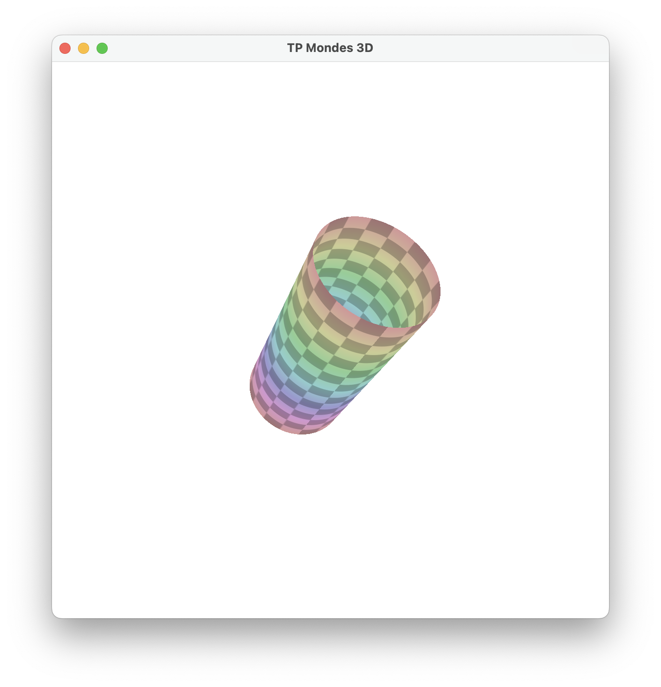
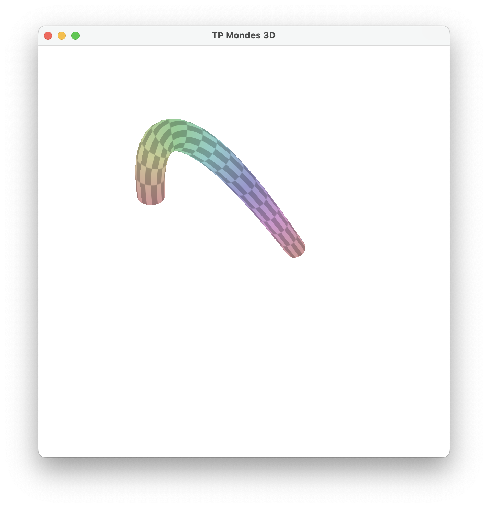
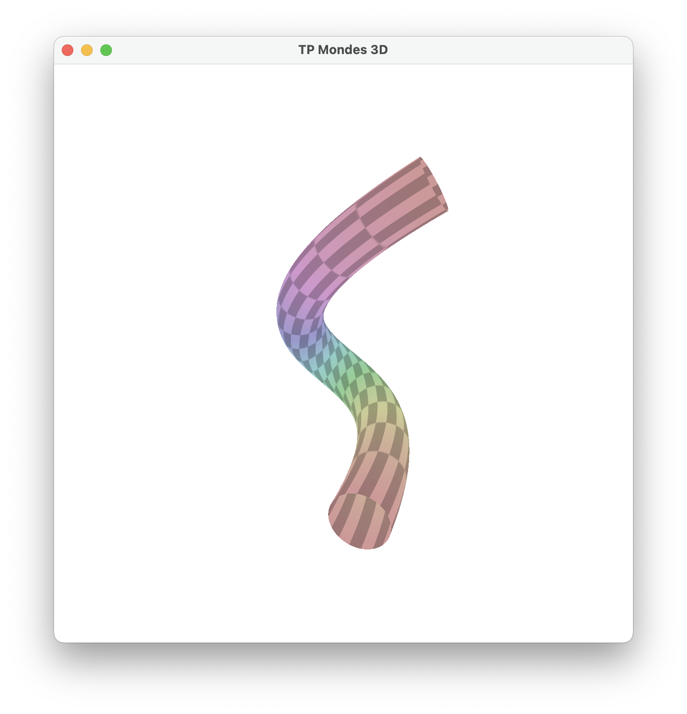
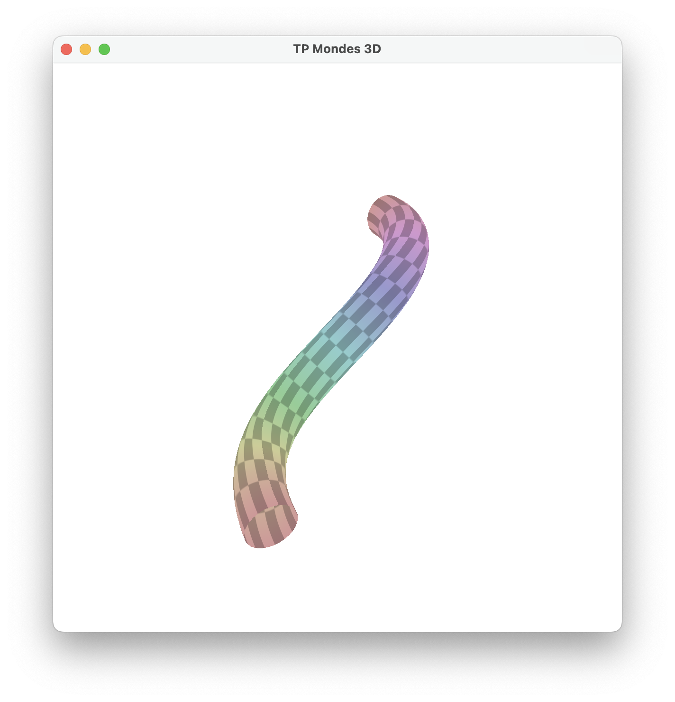

# Courbes et surfaces paramétriques. 

## 2. Cylindre. 

Pour le cyclindre simple, il suffit d'écrire l'équation du cercle et de renvoyer les coordonnées dans le ```main``` : notre fonction remplace ```vtx_position```.

Cependant, si l'on ne suit pas l'axe du repère, le cylindre sera applatit. Il faut alors calculer la matrice ```mat_tbn``` qui permettrat de tranformer notre repère pour qu'il soit orthogonal au point ```u``` comme suit :

```glsl
vec3 cylinder(float u, float v, vec3 A, vec3 B, float r){

  vec3 t = normalize(B - A); 
  vec3 b = vec3(-t.y, t.x, t.z);
  vec3 n = cross(b, t);
  vec3 p = (1 - u) * A + u * B;

  mat4 mat_tbn = mat4(vec4(t, 0), vec4(b, 0), vec4(n, 0), vec4(p, 1));

  float x = 0;
  float y = r * cos(v * 2 * PI);
  float z = r * sin(v * 2 * PI);

  vec4 p_cyl = mat_tbn * vec4(x,y,z,1);
  return vec3(p_cyl.x, p_cyl.y, p_cyl.z);
}
```

Le cylindre est maintenant droit quel que soit l'axe : 

<p>
    
</p>

Pour suivre une courbe de Bézier, on implémente l'algorithme de **Casteljau**.
```p01```, ```p11``` et ```p21``` représententent le polygône de contrôle de la courbe de degré 3, ```p02``` et ```p12``` celui de la courbe de degré 2. 

Pour connaître le plan et obtenir un cylindre qui se comporte comme un câble le long de la courbe, on calcule la tangeante, la normale et la binormale qui sont facilement disponible grâce aux points du polygône. 

```glsl
vec3 bezier(float u, vec3 B[4], out vec3 tangent, out vec3 normal, out vec3 binormal){
  vec3 p01 = (1-u) * B[0] + u * B[1];
  vec3 p11 = (1-u) * B[1] + u * B[2];
  vec3 p21 = (1-u) * B[2] + u * B[3];

  vec3 p02 = (1-u) * p01 + u * p11; 
  vec3 p12 = (1-u) * p11 + u * p21;

  // Ajouter des paramètres en sortie pour récupérer les points de contrôle.
  tangent = normalize(p12 - p02);
  normal = normalize(cross(tangent, vec3(-tangent.y, tangent.x, tangent.z)));
  binormal = cross(normal, tangent);

  return (1-u) * p02 + u * p12;
}
```

C'est dans la fonction ```cylBezierYZ``` qu'on se sert des paramètres supplémentaires calculés précédemment. On construit à nouveau la matrice de transformation. 

```glsl
vec3 cylBezierYZ(float u, float v, vec3 B[4], float r){
  vec3 tangent, normal, binormal;
  vec3 bu = bezier(u, B, tangent, binormal, normal);

  mat4 tbnp = mat4(vec4(tangent, 0), vec4(binormal, 0), vec4(normal, 0), vec4(bu, 1));

  vec2 c_unit = vec2(r * cos(v * 2 * PI), r * sin(v * 2 * PI));

  return (tbnp * vec4(0, c_unit.x, c_unit.y, 1)).xyz;
}
```

## Courbes de Bézier.

Voici les résultats pour chaque ensemble de points définissant un courbe de Bézier : 

```glsl
  courbe = vec3[4](vec3(-1,0,2), vec3(-0.3,0,4), vec3(0.3,0,2), vec3(1,0,-0.5));
```

<p>
    
</p>

```glsl
  courbe = vec3[4](vec3(-0.5,-1,-1), vec3(1.5, 1,-0.3), vec3(-1.5, 1, 0.3), vec3(0.5,-1,1));
```
<p>
    
</p>

```glsl
  courbe = vec3[4](vec3(-1,-0.5,-1), vec3(-1, 1,-0.3), vec3(1, -1, 0.3), vec3(1,0.5,1));
```

<p>
    
</p>
